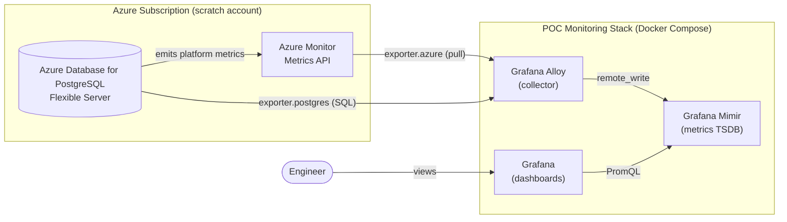
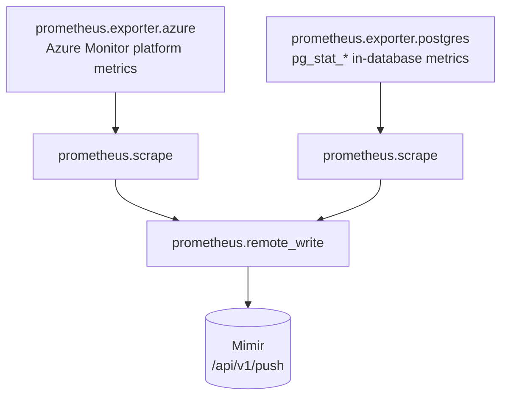
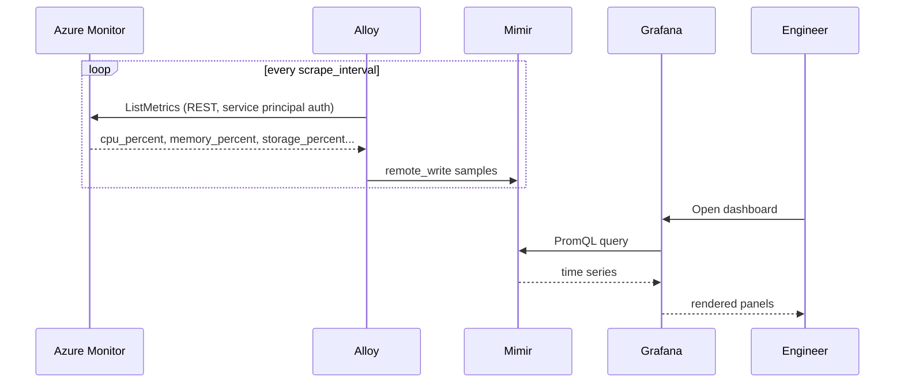
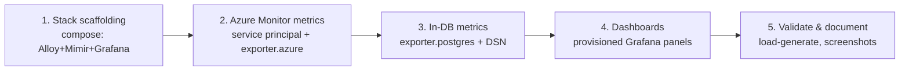

# Technical Brief: Monitoring Azure Managed PostgreSQL with the Grafana Stack (POC)

**Status:** Draft / Proof of Concept
**Owner:** jonathan@manton.com
**Date:** 2026-06-03
**Target environment:** A throwaway ("scratch") Azure subscription provided for the demo.

---

## 1. Goal

Stand up a small, reproducible proof of concept that monitors one or more
**Azure Database for PostgreSQL – Flexible Server** instances using the modern
Grafana metrics stack, and proves out an end-to-end path from "metric emitted in
Azure" to "panel on a Grafana dashboard."

This brief is intentionally scoped as a **demo**, not a production deployment.
The whole stack should run from a single `docker compose up` on one host (the
Claude sandbox or any Docker host — see `AGENTS.md` in the repo root: Docker is
available in the sandbox, you just have to start the daemon).

## 2. The "what is the metrics connector called now?" question

Short answer: there is no longer a single thing called "Prometheus" in the
collect-and-store sense. The Grafana stack has split the old Prometheus
responsibilities into purpose-built components:

| Old world (single Prometheus binary) | Current Grafana stack | Role in this POC |
| --- | --- | --- |
| Prometheus scrape / agent mode | **Grafana Alloy** | Collector. Pulls metrics from Azure Monitor and Postgres, relabels, and `remote_write`s them out. (Alloy is the successor to Grafana Agent.) |
| Prometheus local TSDB / storage | **Grafana Mimir** | Long-term, horizontally scalable metrics store. Speaks the Prometheus `remote_write` ingest API and PromQL on the read side. |
| Prometheus query + UI | **Grafana** | Dashboards and PromQL queries against Mimir. |

So the "metrics connector" you were thinking of is the pairing of **Alloy**
(collection/shipping, replacing the Prometheus/Grafana-Agent role) and **Mimir**
(storage + PromQL, replacing Prometheus' local storage). Prometheus' wire
protocols (`remote_write`, PromQL) live on; the monolithic binary is simply
factored into these components. Plain Prometheus is still a valid drop-in for a
tiny POC, but this brief uses **Alloy + Mimir** as requested.

> Note: Mimir 3.0 (2025) introduced a Kafka-based decoupled read/write
> architecture for scale. For a single-node POC we run Mimir in its
> all-in-one **monolithic mode**, which needs none of that.

## 3. Two complementary sources of PostgreSQL metrics

A frequent gap in Postgres monitoring POCs is collecting only one layer. We
deliberately collect **both**, because they answer different questions:

1. **Azure Monitor platform metrics** — what the Azure control plane sees about
   the managed instance: `cpu_percent`, `memory_percent`, `storage_percent`,
   `active_connections`, IOPS, etc. Emitted at 1-minute granularity with ~93
   days retention. These require **no database credentials** — they come from
   the Azure Monitor REST API. Collected via Alloy's
   **`prometheus.exporter.azure`** component (which embeds `azure-metrics-exporter`).

2. **In-database metrics** — what PostgreSQL itself reports: per-database table
   sizes, `pg_stat_*` counters, replication lag, slow-query and connection
   detail. Collected via Alloy's **`prometheus.exporter.postgres`** component,
   which connects to the server with a normal Postgres DSN.

Layer 1 proves the Azure integration and auth; Layer 2 proves deep database
visibility. The POC includes both; Layer 1 is the priority deliverable since it
is the Azure-specific, higher-risk part.

## 4. Architecture



### 4.1 Collection pipeline inside Alloy



### 4.2 End-to-end collection sequence



## 5. Authentication & required Azure access

The Azure exporter authenticates through the Azure SDK default credential chain.
For the POC we use a dedicated **service principal** so nothing is tied to a
personal login:

- Create an app registration / service principal in the scratch tenant.
- Grant it the **Monitoring Reader** role, scoped to the resource group (or
  subscription) that holds the Flexible Server. Monitoring Reader is enough to
  read metrics — no data-plane DB access and no write permissions.
- Provide credentials to Alloy via environment variables consumed by the SDK:
  `AZURE_CLIENT_ID`, `AZURE_CLIENT_SECRET`, `AZURE_TENANT_ID`, plus the target
  `AZURE_SUBSCRIPTION_ID`.

For the in-database exporter (Layer 2), create a least-privilege monitoring role
in Postgres (e.g. a login with `pg_monitor`) and pass it to Alloy as a DSN. The
Flexible Server's firewall / network rules must allow the host running the stack.

## 6. Reference Alloy configuration (illustrative)

> Exact metric names and `resource_type` come from the Azure Monitor supported-
> metrics reference; the values below are representative starting points.

```alloy
// ---- Layer 1: Azure Monitor platform metrics ----
prometheus.exporter.azure "postgres" {
    subscriptions = [sys.env("AZURE_SUBSCRIPTION_ID")]
    resource_type = "Microsoft.DBforPostgreSQL/flexibleServers"
    regions       = ["eastus"]
    metrics = [
        "cpu_percent",
        "memory_percent",
        "storage_percent",
        "active_connections",
        "iops",
    ]
    // client_id / client_secret / tenant_id are read from the
    // standard AZURE_* environment variables by the Azure SDK.
}

prometheus.scrape "azure" {
    targets    = prometheus.exporter.azure.postgres.targets
    forward_to = [prometheus.remote_write.mimir.receiver]
    scrape_interval = "60s"   // Azure emits at 1-minute granularity
}

// ---- Layer 2: in-database metrics ----
prometheus.exporter.postgres "db" {
    data_source_names = [sys.env("POSTGRES_DSN")]
}

prometheus.scrape "postgres" {
    targets    = prometheus.exporter.postgres.db.targets
    forward_to = [prometheus.remote_write.mimir.receiver]
    scrape_interval = "30s"
}

// ---- Ship everything to Mimir ----
prometheus.remote_write "mimir" {
    endpoint {
        url = "http://mimir:9009/api/v1/push"
        headers = { "X-Scope-OrgID" = "demo" }  // Mimir tenant header
    }
}
```

## 7. Proposed POC layout (in this directory)

```
azure/pg-grafana/
├── technical-brief.md          # this document
├── docker-compose.yml          # alloy + mimir + grafana (to be added)
├── alloy/
│   └── config.alloy            # the pipeline above
├── mimir/
│   └── mimir.yaml              # monolithic single-node config
├── grafana/
│   └── provisioning/           # datasource (Mimir) + dashboards
├── infra/                      # optional: az CLI / Bicep to create the DB + SP
└── .env.example                # AZURE_* and POSTGRES_DSN placeholders
```

All secrets stay in a git-ignored `.env`; only `.env.example` is committed.

## 8. Implementation phases



1. **Stack scaffolding** — `docker-compose.yml` brings up Alloy, single-node
   Mimir, and Grafana with Mimir auto-provisioned as a datasource. Success = the
   three containers are healthy and Grafana can query Mimir.
2. **Azure Monitor metrics** — provision the scratch Flexible Server, create the
   service principal with Monitoring Reader, wire up `prometheus.exporter.azure`.
   Success = `cpu_percent` for the real instance is visible in Grafana.
3. **In-database metrics** — add the monitoring role and `prometheus.exporter.postgres`.
   Success = `pg_stat_*`-derived metrics appear.
4. **Dashboards** — provision a Postgres overview dashboard (CPU, memory,
   storage, connections, IOPS) combining both layers.
5. **Validate & document** — generate a little load (e.g. `pgbench`), confirm the
   graphs move, capture screenshots, and write a short README.

## 9. Scope, assumptions, and non-goals

**Assumptions**
- A scratch Azure subscription will be provided, with rights to create a
  Flexible Server and a service principal (or these will be pre-created).
- The demo runs on a single Docker host; no Kubernetes.

**Non-goals for the POC**
- High availability / clustering of Mimir (monolithic single node is fine).
- Long-term retention, durable object storage, multi-tenancy beyond one tenant.
- Alerting, log collection (Loki), and tracing (Tempo) — metrics only.
- Production-grade secret management (we use a local `.env`).
- Hardening, TLS between components, or exposing the stack publicly.

**Open questions for the account provider**
- Will the Flexible Server and service principal be pre-provisioned, or should
  the POC create them (via `az` CLI / Bicep in `infra/`)?
- Which region(s) and how many instances should the demo target?
- Any restriction on enabling Postgres network access from the demo host?

## 10. References

- [prometheus.exporter.azure | Grafana Alloy docs](https://grafana.com/docs/alloy/latest/reference/components/prometheus/prometheus.exporter.azure/)
- [prometheus.exporter.postgres | Grafana Alloy docs](https://grafana.com/docs/alloy/latest/reference/components/prometheus/prometheus.exporter.postgres/)
- [Collect Azure Metrics with Grafana Alloy | Grafana Cloud docs](https://grafana.com/docs/grafana-cloud/monitor-infrastructure/monitor-cloud-provider/azure/config-azure-metrics/)
- [Grafana Mimir architecture | Grafana docs](https://grafana.com/docs/mimir/latest/get-started/about-grafana-mimir-architecture/)
- [Send metric data to Mimir | Grafana docs](https://grafana.com/docs/mimir/latest/send/)
- [Supported metrics — Microsoft.DBforPostgreSQL/flexibleServers | Microsoft Learn](https://learn.microsoft.com/en-us/azure/azure-monitor/reference/supported-metrics/microsoft-dbforpostgresql-flexibleservers-metrics)
- [Monitoring and metrics — Azure Database for PostgreSQL | Microsoft Learn](https://learn.microsoft.com/en-us/azure/postgresql/flexible-server/concepts-monitoring)
